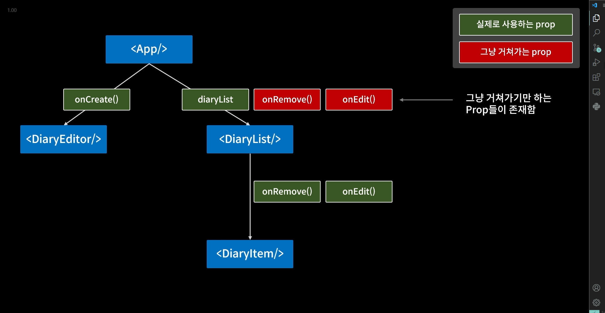
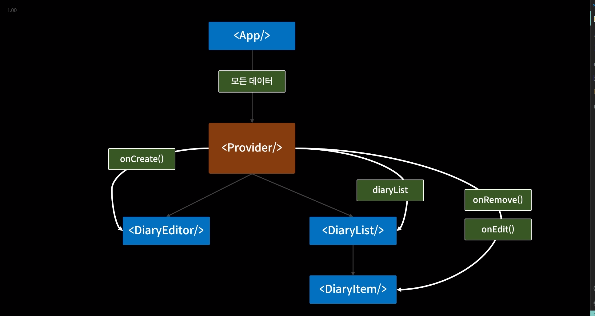
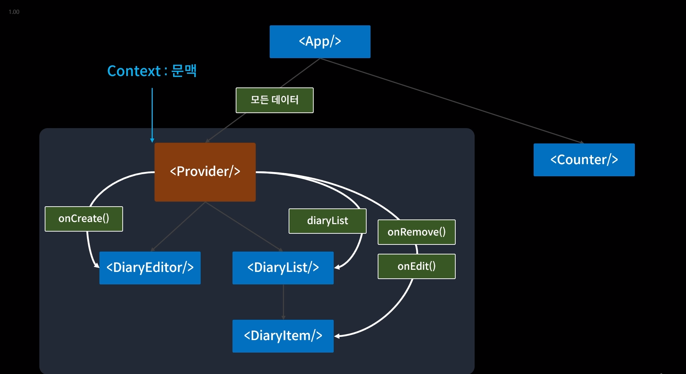

#### 날짜, 시간 사용
const created_date = new Date().getTime();
new Date(created_date).toLocaleString()

#### useEffect
- Dependency Array에 들어있는 값이 변경되면 콜백함수 실행
- Dependency Array에 빈 배열 전달 ->component 처음 mount될 때만 콜백함수 실행
- Dependency Array 아무것도 전달하지 않으면 컴포넌트 업데이트 되는 순간마다 콜백함수 실행

### Props 드릴링 - 단방향 흐름 때문에 발생하는 문제 

- 문제해결
직방으로 Props를 줄 수 있는 공급자컴포넌트<Provier /> 생성
<Provider /> 자식노드로 배치

<Provider /> 자식으로 배치되어있지 않으면 접근 불가
같은 Context가 아님.
